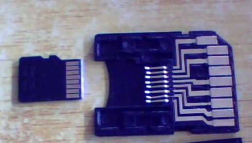
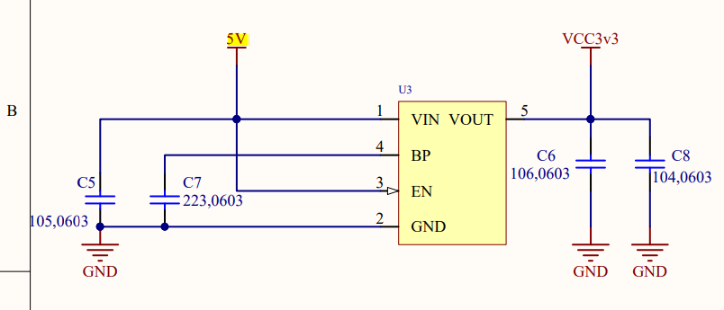

# -STM32-
通过制作一个stm32读卡器来锻炼自己的Embeded Level

可是由于stm32芯片的USB原因，读写的速度很慢，只能几百k！

# 笔记：

## 环境配置：

不同stm32f103芯片的的代码移植：

https://blog.csdn.net/ysgjiangsu/article/details/89930634

注意启动文件(.s文件)里面：https://blog.csdn.net/T_Peach_T/article/details/104238954

要注意的是：原子的例程里面，delay_ms()里面，传入的参数不能超过1000！！！

### 硬件：

+ 在用原子的移植的时候，原子的时候大的SD卡，可是要做成TF卡的大小，对应的引脚要注意对应：

+ 在看别人的原理图的时候，电阻上面标记20R意思就是20Ω。

+ 降压芯片的选取（5V-3.3V）：RT9193 

  需要注意的是，这个降压芯片使用适用于低功率的电路，要是很大功率的要使用AMS1117

  降压电路参考最小板的设计：

  

